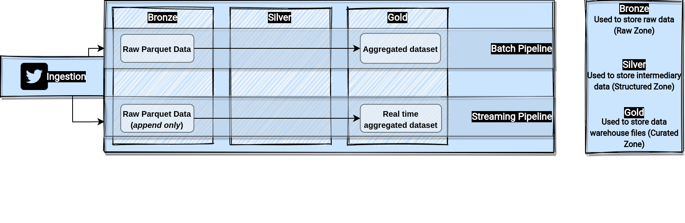

    
    <h1>Tweets</h1>
    <b>Data Pipeline example using Lambda Architecture</b>
      

 

    
    
    
    

## Table of Contents

1. [Proposed data architecture](#data_arch)
2. [Proposed datalake zones](#data_zones)
3. [Running](#t3)

&nbsp;
<h1>Proposed data architecture</h1>
<h1 name="data_arch">Proposed data architecture</h1>

This architecture is based on the most common Big Data Archicture, called as **Lambda Archicteture**, that's divided according those topics:
* **Data Source**: Responsible to map a new data source, such as Twitter API. 
* **Batch Layer**: Responsible to mantain components that can handle very large quantities of data.
* **Speed Layer**: Reponsible to maintain components that processes data streams in real time.
* **Serving Layer**: Output from the batch and speed layers are stored in the serving layer, which responds to ad-hoc queries by returning precomputed views or building views from the processed data.

</img>

***obs: Those components are wrapped by docker container environment.***

&nbsp;
<h1 name="data_zones">Proposed datalake zones</h1>
</img>

