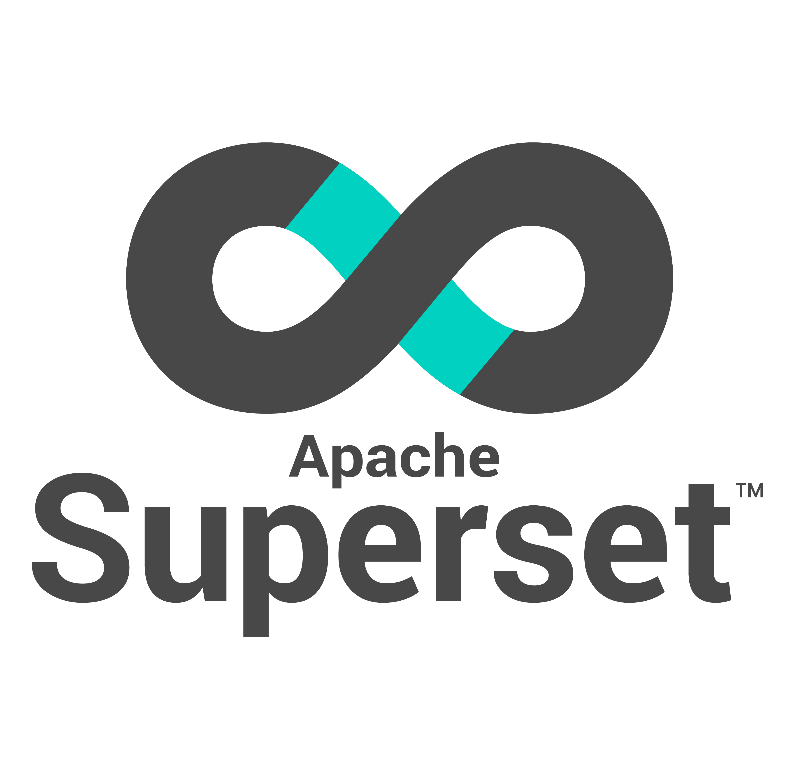

<h1 align="center">
  <br>
  <a href="https://developer.twitter.com/en"></a>
  <br>
  <b>
  Tweets
  </b>
  <br>
</h1>

<h4 align="center">A Twitter API data pipeline case using Lambda Architecture.</h4>

<p align="center">
  <a href="https://www.python.org/">
    
  </a>
  <a href="https://github.com/psf/black"></a>
  
  <a href="https://opensource.org/licenses/Apache-2.0">
      
  </a>

  <a href="https://pypi.org/project/tweepy/3.10.0/">
    
  </a>

  <a href="https://www.docker.com/">
    
  </a>

  <a href="https://docs.docker.com/compose/install/">
    
  </a>
  
</p>

<p align="center">
  <a href="#data-archicteture">Data Archicteture</a> •
  <a href="#how-to-use">How To Use</a> •
  <a href="#service-mapping">Service Mapping</a> •
  <a href="#references">References</a> •
  <a href="#todo">ToDo</a>
</p>

&nbsp;


Data Archicteture
============

This architecture is based on the most common Big Data Archicture, called as **Lambda Archicteture**, that's divided according those topics:
* **Data Source**: Responsible to map a new data source, such as Twitter API. 
* **Batch Layer**: Responsible to mantain components that can handle very large quantities of data.
* **Speed Layer**: Reponsible to maintain components that processes data streams in real time.
* **Serving Layer**: Output from the batch and speed layers are stored in the serving layer, which responds to ad-hoc queries by returning precomputed views or building views from the processed data.


***obs: Those components are wrapped by docker container environment.***

&nbsp;

How To Use
============

To run this application, you'll need [Git](https://git-scm.com), [Docker](https://docs.docker.com/get-docker/) and [Python Virtual Environment](https://docs.python.org/3/tutorial/venv.html) installed on your computer. Run the commands bellow to start:

```bash
# Clone this repository
$ git clone https://github.com/marcosvgj/tweets.git

# Go into the repository
$ cd tweets

# Setting twitter developer credentials
$ make configure

# Build virtual environment to this project
$ python3 -m venv tweets

# Load virtual environment to this project
$ source tweets/bin/activate

# Run Makefile that will run everything that you need to start the application.
$ make start

# *Note: This pipeline was made to Unix environments.*
```

&nbsp;

Service Mapping
=========
This topic is destinated to map the components created by **Docker Compose** in previous step: 

|Component|Port|Version|Location|
|:---|:---:|:---:|---:|
|<a href="https://spark.apache.org/"></a>|8080|3.0.1|http://127.0.0.1:8080/|
|<a href="https://superset.apache.org/"></a>|8088| 0.35.2 |http://127.0.0.1:8088/|
|<a href="https://airflow.apache.org/"></a>|8090| 2.0 |http://127.0.0.1:8090/|


&nbsp;

&nbsp;

References
=========

## TODO 

&nbsp;

Todo's
=========

## TODO 

&nbsp;